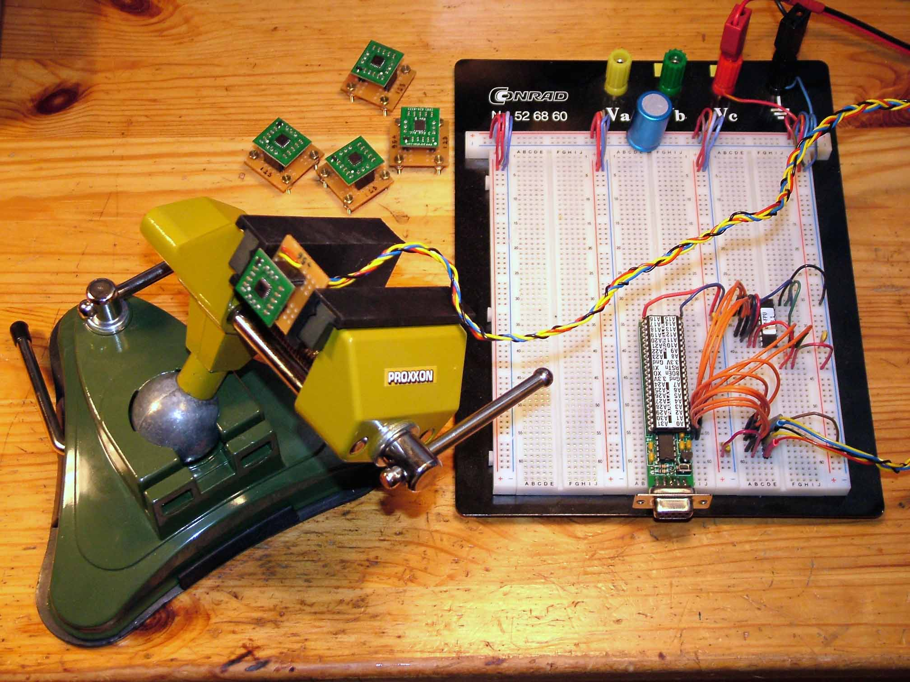

# General MEMS Sensor Model

By: I.Kövesdi

Language: Spin, Assembly

Created: Mar 27, 2013

Modified: April 9, 2013

This PST application includes three steps of the make and use of a simple and general mathematical sensor model for 3-axis MEMS sensors in embedded applications. This Calibration/Error Model works well with any kind of 3-axis Accelero, Gyro and Magnetic MEMS devices. Here, data of a Hitachi H48C 3-axis Accelerometer Modul is used as a "Proof of Concept" of the method in real practice where the original 10% accuracy of the sensor was improved to reach ±1mg (0.2%). The General Sensor Model contains a real-time Temperature Correction procedure, which is excersized, too. This object uses the uM-FPU 3.1 Floating Point Coprocessor, but that feature is not essential for the implementation of the object at lower sensor data rates (<100Hz) for a single sensor. 

In this upgrade the System Boot EEPROM on I/O pins 28/29 is used to store the data during calibration, parameter calculation and model application. This is much more convenient than the manual recording and data retyping was in the previous versions.

